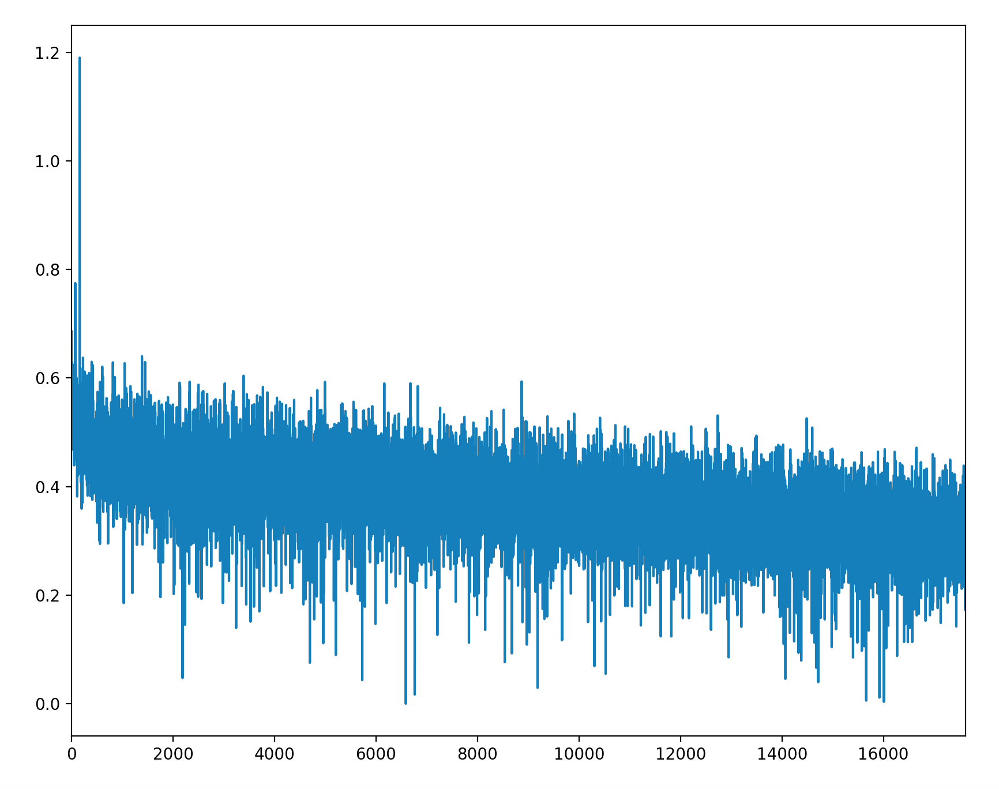

# Using binary classifier to class the topics

## index = 730 topic = 4054009175749343326

#### step = 178530

- 
- learning_rate = 0.001
- batch_size = 128
- topic_num = 2
- num_hidden = 256
- word desc max_time = 30
- word title max_time = 10

